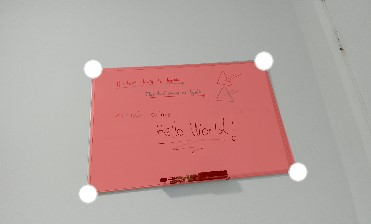
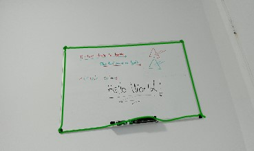
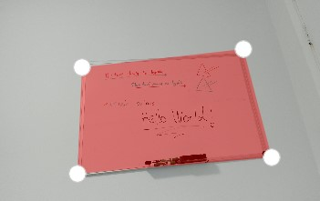
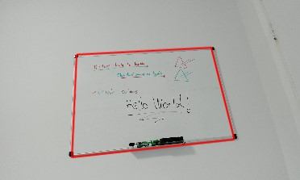
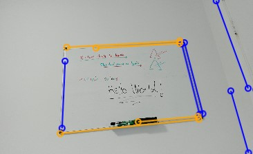

# Image Scanning Windows Vision Skills samples

These samples will show you how to use the set of skills contained in the Image Scanning Windows Vision Skill NuGet package to create apps that can achieve productivity scenarios related to scanning content. 
- [C# UWP sample app](./cs/ImageScanningSample_UWP)
- [Win32 C++/Winrt Desktop console app](./cpp/ImageScanningSample_Desktop)
- [.Net Core 3.0 C# console app](./cs/ImageScanningSample_NetCore3)

## Included Skills

### **CurvedEdgesDetector** <a name="CurvedEdgesDetectorExample"></a> 
Seeks within an image the pixels that constitute the curved edges composing the contour of a given quad and returns their coordinates.

| Input image and base quad specified | Ouput detected curved edge |
| ----------------------------------- | -------------------------- |
|  |  |

### **ImageCleaner** <a name="ImageCleanerExample"></a>
Cleans and enhances an image given a specified preset.

| Input image and image cleaning kind specified (whiteboard) | Ouput processed image |
| ---------------------------------------------------------- | --------------------- |
|  |  |

### **ImageRectifier** <a name="ImageRectifierExample"></a>
Rectifies and crops an image to a rectangle plane given four UV coordinates.

| Input image and cropping shape specified | Ouput rectified image |
| -----------------------------------------| --------------------- |
|  |  |

### **QuadDetector** and **LiveQuadDetector** <a name="QuadDetectorExample"></a>
 Searches an image for quadrilateral shapes and returns the coordinates of their corners if found. 
The **LiveQuadDetector** is a stateful version of the **QuadDetector** that attempts to detect only 1 quadrangle and keeps track of the previous quad detected to be used as guide which optimizes tracking performance as new frames are bound over time. This is well suited for most scenarios operating over a stream of frames over time.
**QuadDetector** can be set to detect more than 1 quadrangle and will search the whole frame everytime unless a previous quadrangle is provided.

| Input image | Ouput detected quadrangle |
| -----------------------------------------| --------------------- |
|  |  |

### **QuadEdgesDetector** <a name="QuadEdgesDetectorExample"></a>
Searches an image for the horizontal and vertical lines defining potential quadrilateral edges and returns their coordinates.

| Input image | Ouput detected vertical and horizontal quadrangle edges |
| -----------------------------------------| --------------------- |
|  |  |

While the [UWP sample](./cs/ImageScanningSample_UWP) showcases each skill individually in an interative fashion with corresponding useful UI control helpers, the [.NetCore 3.0](./cs/ImageScanningSample_NetCore3) and [Win32](./cpp/ImageScanningSample_Desktop) console samples combine 3 skills executed in succession to achieve a common productivity task consisting of scanning a piece of content (document, whiteboard, picture, etc.) within a photo. Namely:
1. Running **QuadDetector** using a specified input image
2. Using the quad detected in previous step as input to the **ImageRectifier** to rectify the same input image
3. Using the output rectified image from previous step as input to the **ImageCleaner** to produce a cleaner image

| Input image | Ouput scanned image |
  | ----------------------------------- | -------------------------- |
  |  |  |


## Build samples
- Refer to the [sample guidelines](../README.md)
- Make sure the Microsoft.AI.Skills.Vision.ImageScanningPreview and Microsoft.AI.Skills.SkillInterfacePreview NuGet packages are installed on your app projects

## Related topics

- [Microsoft.AI.Skills.SkillInterfacePreview API document](../../doc/Microsoft.AI.Skills.SkillInterfacePreview.md)
- [Microsoft.AI.Skills.Vision.ImageScanningPreview API document](../../doc/Microsoft.AI.Skills.Vision.ImageScanningPreview.md)
- [Creating a custom Windows Vision Skill](../SentimentAnalyzerCustomSkill)
- [Win32 Desktop sample applications for using Windows Media Capture APIs](https://github.com/microsoft/Windows-Camera/tree/master/Samples/WMCConsole_winrtcpp)
- [Using MediaFrameReader](https://docs.microsoft.com/windows/uwp/audio-video-camera/process-media-frames-with-mediaframereader)

## Run the UWP sample

The app's top panel allows you to navigate through each skill. Right under it, you can consult each skill's information, input and output feature descriptions as well as the available execution devices. Start experimenting by selecting a .jpg or .png image file which will then show inputs controls as well as the 'Run' button which trigger the skill execution and produces output(s).

### Using the skills (C#)

As with all Vision Skills, the skills contained in this package are each composed of an `ISkillDescriptor` (which holds general skill information), the `ISkill` instance (which is bound to a specific `ISkillExecutionDevice`), and the skill's `ISkillBinding` (which holds skill inputs, outputs, and any state information). As with any `ISkillBinding` derivatives, you may interact with the binding instances like it is a Dictionary to set and retrieve your `SkillFeatures` and their linked `ISkillFeatureValue`. 
Additionally, the `ISkillBinding` derivatives defined in this package declare convenience field(s) and they are used in the below C# code snippets.
i.e.:
```csharp
// Pretend we have instantiated a CurvedEdgesDetectorSkill instance named skill like the below example shows
// We create a binding instance
ISkillBinding binding = await skill.CreateSkillBindingAsync();

// We retrieve an input image we want to bind (see Related topics)
VideoFrame inputImage = RetrieveYourVideoFrame();

// The following 2 examples do the same thing: binding the input image

// 1. Bind an input image Dictionary-style using the generic ISkillBinding API
await binding["InputImage"].SetFeatureValueAsync(inputImage)

// 2. Bind an input image using the convenience method exposed by this ISkillBinding derivatives
CurvedEdgesDetectorBinding concreteBinding = binding as CurvedEdgesDetectorBinding;
await concreteBinding.SetInputImageAsync(inputImage);
```

Here are examples for using each skill:

#### **CurvedEdgesDetector**
```csharp
using Microsoft.AI.Skills.Vision.ImageScanningPreview;
using Windows.Media; // Defining "VideoFrame"
using Windows.Foundation; // Defining "Point"
...
CurvedEdgesDetectorDescriptor descriptor = new CurvedEdgesDetectorDescriptor();
CurvedEdgesDetectorkill skill = await descriptor.CreateSkillAsync() as CurvedEdgesDetectorSkill; // If you don't specify an ISkillExecutionDevice, a default will be automatically selected
CurvedEdgesDetectorBinding binding = await skill.CreateSkillBindingAsync() as CurvedEdgesDetectorBinding;
...
// Specify an input image retrieved in code (RetrieveYourVideoFrame() is left to user to implement, see Related topics)
VideoFrame inputImage = RetrieveYourVideoFrame();
await binding.SetInputImageAsync(inputImage);

// Specify the corners of the guiding quadrangle shape (arbitrary in this case)
List<Point> inputQuadCorners = new List<Point>
        {
            new Point(0.2, 0.2),
            new Point(0.7, 0.1),
            new Point(0.8, 0.9),
            new Point(0.3, 0.9)
        };
await binding.SetInputQuadAsync(inputQuadCorners);

// Execute the skill
await skill.EvaluateAsync(binding);

// Retrieve the output detected polyline points
IReadOnlyList<Point> detectedCurvedEdges = binding.DetectedCurvedEdges;
```

#### **ImageCleaner**
```csharp
using Microsoft.AI.Skills.Vision.ImageScanningPreview;
using Windows.Media; // Defining "VideoFrame"

...
ImageCleanerDescriptor descriptor = new ImageCleanerDescriptor();
ImageCleanerkill skill = await descriptor.CreateSkillAsync() as ImageCleanerSkill; // If you don't specify an ISkillExecutionDevice, a default will be automatically selected
ImageCleanerBinding binding = await skill.CreateSkillBindingAsync() as ImageCleanerBinding;
...
// Specify an input image retrieved in code (RetrieveYourVideoFrame() is left to user to implement, see Related topics)
VideoFrame inputImage = RetrieveYourVideoFrame();
await binding.SetInputImageAsync(inputImage);

// Specify the ImageCleaningKind to use (in this case Whiteboard)
await binding.SetImageCleaningKindAsync(ImageCleaningKind.Whiteboard);

// Execute the skill
await skill.EvaluateAsync(binding);

// Retrieve the output processed image
VideoFrame outputImage = binding.OutputImage;
```

#### **ImageRectifier**
```csharp
using Microsoft.AI.Skills.Vision.ImageScanningPreview;
using Windows.Media; // Defining "VideoFrame"
using Windows.Foundation; // Defining "Point"

...
ImageRectifierDescriptor descriptor = new ImageRectifierDescriptor();
ImageRectifierkill skill = await descriptor.CreateSkillAsync() as ImageRectifierSkill; // If you don't specify an ISkillExecutionDevice, a default will be automatically selected
ImageRectifierBinding binding = await skill.CreateSkillBindingAsync() as ImageRectifierBinding;
...
// Specify an input image retrieved in code (RetrieveYourVideoFrame() is left to user to implement, see Related topics)
VideoFrame inputImage = RetrieveYourVideoFrame();
await binding.SetInputImageAsync(inputImage);

// Specify the corners of the quadrangle cropping shape (arbitrary in this case)
List<Point> inputQuadCorners = new List<Point>
        {
            new Point(0.2, 0.2),
            new Point(0.7, 0.1),
            new Point(0.8, 0.9),
            new Point(0.3, 0.9)
        };
await binding.SetInputQuadAsync(inputQuadCorners);

// Specify the ImageRectifierInterpolationKind to use (in this case Bicubic)
await binding.SetInterpolationKind(ImageRectifierInterpolationKind.Bicubic);

// Execute the skill
await skill.EvaluateAsync(binding);

// Retrieve the output rectified image
VideoFrame outputImage = binding.OutputImage;
```

#### **LiveQuadDetector**
```csharp
using Microsoft.AI.Skills.Vision.ImageScanningPreview;
using Windows.Media; // Defining "VideoFrame"
using Windows.Foundation; // Defining "Point"

...
LiveQuadDetectorDescriptor descriptor = new LiveQuadDetectorDescriptor();
LiveQuadDetectorkill skill = await descriptor.CreateSkillAsync() as LiveQuadDetectorSkill; // If you don't specify an ISkillExecutionDevice, a default will be automatically selected
LiveQuadDetectorBinding binding = await skill.CreateSkillBindingAsync() as LiveQuadDetectorBinding;
...
// Specify an input image retrieved in code (RetrieveYourVideoFrame() is left to user to implement, see Related topics)
VideoFrame inputImage = RetrieveYourVideoFrame();
await binding.SetInputImageAsync(inputImage);

// Execute the skill
await skill.EvaluateAsync(binding);

// Retrieve the output detected quadrangle corners as well as the cue if it is similar to the last time the skill was evaluated
bool isSimilar = false;
IReadOnlyList<Point> detectedQuad = binding.DetectedQuad(out isSimilar);
```

#### **QuadDetector**
```csharp
using Microsoft.AI.Skills.Vision.ImageScanningPreview;
using Windows.Media; // Defining "VideoFrame"
using Windows.Foundation; // Defining "Point"

...
QuadDetectorDescriptor descriptor = new QuadDetectorDescriptor();
QuadDetectorkill skill = await descriptor.CreateSkillAsync() as QuadDetectorSkill; // If you don't specify an ISkillExecutionDevice, a default will be automatically selected
QuadDetectorBinding binding = await skill.CreateSkillBindingAsync() as QuadDetectorBinding;
...
// Specify an input image retrieved in code (RetrieveYourVideoFrame() is left to user to implement, see Related topics)
VideoFrame inputImage = RetrieveYourVideoFrame();
await binding.SetInputImageAsync(inputImage);

// Execute the skill
await skill.EvaluateAsync(binding);

// Retrieve the output detected quadrangle(s) corners 
IReadOnlyList<Point> detectedQuad = binding.DetectedQuad();
```

#### **QuadEdgesDetector**
```csharp
using Microsoft.AI.Skills.Vision.ImageScanningPreview;
using Windows.Media; // Defining "VideoFrame"
using Windows.Foundation; // Defining "Point"

...
QuadEdgesDetectorDescriptor descriptor = new QuadEdgesDetectorDescriptor();
QuadEdgesDetectorkill skill = await descriptor.CreateSkillAsync() as QuadEdgesDetectorSkill; // If you don't specify an ISkillExecutionDevice, a default will be automatically selected
QuadEdgesDetectorBinding binding = await skill.CreateSkillBindingAsync() as QuadEdgesDetectorBinding;
...
// Specify an input image retrieved in code (RetrieveYourVideoFrame() is left to user to implement, see Related topics)
VideoFrame inputImage = RetrieveYourVideoFrame();
await binding.SetInputImageAsync(inputImage);

// Execute the skill
await skill.EvaluateAsync(binding);

// Retrieve the output detected edge(s) points 
IReadOnlyList<Point> detectedHorizontalEdges = binding.DetectedHorizontalEdges();
IReadOnlyList<Point> detectedVerticalEdges = binding.DetectedVerticalEdges();
```

